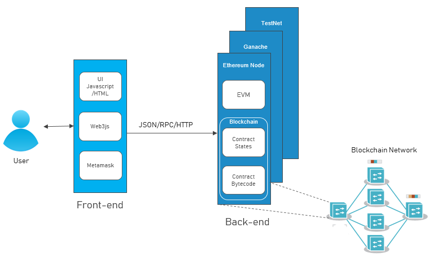

# Block One: Smart Contract Game Layout


## What are Smart Contracts?

Smart contracts are the building blocks of Ethereum (also, avalanche, Solana, etc.). These are programs written in the language Solidity (`*.sol` files) which was created by the early Ethereum team. There are also a number of other languages that can be used to write smart contracts.

Smart contracts take real world contracts and put them into code. The beauty is that when a smart contract is deployed to a blockchain it cannot be changed, and we can trust the contract will execute as written by the blockchains consensus mechanism. These programmable contracts act as a trustless, public, automatic, predictable middle man. For example, a broker who we trust to handle the paperwork required with trading securities is the middle man. The broker has the know-how to fill out all the paper work and make a transaction smooth. In theory a smart contract could take the place of a broker, by using code to facilitate a transaction of ownership where both parties trust the code (because it is public and readable) to do exactly what they agreed upon.


### A Contract for Games?

A contract doesn't have to be as black and white as physically signing papers to trade ownership. By playing a board game each player is "signing a contract" with everyone that they agree to play by the rules. Everyone knows that a player who lands on **Park Place** owes the owner $35 rent in Monopoly money, of course.

Hopefully you are starting to see how a smart contract can ensure everyone plays by the rules when playing a game. In terms of Solidity code, this looks like creating functions to outline how a player can interact with the game, structures (aka, structs) to define the attributes that game characters have. This will govern how the game is played.


### Why use Smart Contracts for This?

Why would we use smart contracts and put this on the blockchain when we can just run this game on a web server and store the game data in an sql database?

Well... Partly because we think this is a fun way to learn how to code in Solidity. More importantly it will allow us to put the game on the blockchain, this way the code cannot be changed. A player can trust that we aren't going to change the rules in the future, arbitrarily give someone more xp, etc. There is no question about who owns what character and how they can interact with the game. All someone would have to do is look at [etherscan.io](https://etherscan.io/) and read the Solidity smart contract. They could even read it, see that they don't like the game mechanics and choose not to play.

## Our Game Architecture

Here we are going to look at the architecture of dapps in general.

Before we start I want to mention that Solidity smart contracts would be considered the backend of our app. In our case the data storage would technically just be "on chain" meaning it is written to the blockchain itself and can be easily called when needed. This is not the most gas efficient, but we are just learning right now.

We will look into the frontend later on in the semester, but for now just know that it is like any other web app. A common language/framework to use is [ReactJS](https://reactjs.org/). This is a frontend JavaScript framework and you can use [ethers.js](https://docs.ethers.io/v5/) or [web3.js](https://web3js.readthedocs.io/en/v1.7.0/) libraries to connect the backend to the frontend.

Here is a model of the decentralized app architecture for our purposes:



> Later on we will plug other pieces into this puzzle. You can use Oracles to plug in real time data or create a truly random generator. Or you can store files that are referenced on [IPFS](https://ipfs.io/)


## Our Game's Backend Layout

Now that we have a high level understanding of a dapp's architecture let's dive into the layout of the backend for the purpose of our game. You can find a more detailed description of the game [here](https://github.com/badgerblockchain/badger-blocks/blob/main/README.md). But we will look at the different files of our dapp and how they make our game possible.

Under our `/contracts` folder we will see three different files. `Badger.Sol`, `BadgerWorld.sol`, and `ERC721.sol`.

### ERC721.sol:

This contract is a standard interface for non-fungible tokens (aka, NFTs). It outlines the basic functionality needed to track, transfer, burn, and mint NFTs. In our case this is a simpler version because we don't need all the complexity with an ERC721 such as this [one](https://github.com/OpenZeppelin/openzeppelin-contracts/blob/master/contracts/token/ERC721/IERC721.sol).

Ours will look something like this:

```
// SPDX-License-Identifier: MIT
pragma solidity^0.8.9;

abstract contract ERC721 {

    // events
    event Transfer(address indexed _from, address indexed _to, uint256 indexed _tokenId);
    event Approval(address indexed _owner, address indexed _approved, uint256 indexed _tokenId);

    // mappings
    mapping(address => uint256) public balanceOf;
    mapping(uint256 => address) public ownerOf;
    mapping(uint256 => address) public approvals;

    // functions
    function transferFrom(address _from, address _to, uint256 _tokenId) external virtual payable;
    function approve(address _approved, uint256 _tokenId) public virtual payable;
    function _mint(address _to, uint256 _tokenId) internal virtual;
    function _burn(uint256 _tokenId) internal virtual;

}
```

For our game, [Badger Blocks](https://github.com/badgerblockchain/badger-blocks), those are the only functions we will need. They will take care of `minting` a Badger NFT, `burning`, `transferring`, and who owns what Badger. To familiarize ourselves, minting means creating an NFT. In Badger Blocks each player (a player is essentially your wallet address) can mint and own ONE Badger at a time. We will write logic to prevent people from creating one if they already own one.

Once a Badger reaches the max level the NFT is subsequently burned. This allows a player to mint a new Badger or "buy" one that is already in circulation. Now we are starting to see what a Badger is in smart contract world and the characteristics it will have.


### Badger.sol:

This contract is where the bulk of our code that dictates a Badger's attributes and functions will reside. In our case we will inherit the ERC721.sol file and write the logic for those functions (the logic is pretty much the same as any other ERC721 so you can "copy" in a sense because it is a standard).

Aside from that we will have global variables that will outline the attributes a Badger will keep. For those CS kids this will be in a struct called BadgerToken. This is the data structure for Badgers (again this is not the most gas efficient to store on chain, but we are learning) that will live on chain and can theoretically be called by any wallet or other smart contract given we make a public function to do so.

The attributes a Badger will have are as follows:
- level
- xp
- winCount (comes in handy when we implement attacking)
- lossCount
- name
- among others that will make sense later

This file does a lot of book keeping for us, but we thought it also made sense to add a few basic functions. The functionality that can be found in this contract is:
- calculating max xp based on level
- increasing xp by a set amount
- decreasing xp (can happen from "gambling" or losing an attack)
- leveling up a Badger
- returning relevant Badger attributes to the frontend when called

Now we have a better understanding of the types of things a game may implement using a smart contract surrounding data tracking and game character attributes/functionality.


### BadgerWorld.sol:

As you will come to find out this file will contain functions that deal with the things a Badger can do within the game. What I mean by that is that a Badger can attack other Badgers, bet their XP on a coin flip, claim daily xp rewards, get rewards from the master Badger (aka, Bucky).

Simply these are the things that you can do within the game that we will code within the next two development sessions. One thing to note is that these functions outline game characteristics that don't necessarily have to do with how a Badger is set up. However, these functions affect the state of a Badger's attributes. Most of the functions will exhibit what we call `state changes` that affect the data of individual Badgers that is stored on chain.


## Any Questions?

Feel free to reach out to me (contact info on the [README](https://github.com/badgerblockchain/development-guide/blob/main/README.md#authors)) and you can reference the skeleton code we have uploaded to [Badger-Blocks](https://github.com/badgerblockchain/badger-blocks).