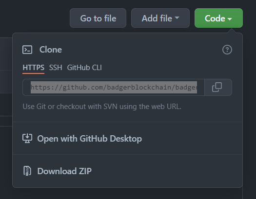

# Introductory Block: Environment Setup

By following this introductory block you will be able to setup your workspace for blockchain development.


## What You Need to Start

Before you can follow this tutorial you will need to have a few things installed on your computer.

+ Install an IDE. Any will work if you are comfortable with it, but we are using [Visual Studio Code](https://code.visualstudio.com/download). Below is a list of extensions (plug ins) you should have if you are using VS Code. [How to install plugins](https://code.visualstudio.com/learn/get-started/extensions)
  + [SonarLint](https://marketplace.visualstudio.com/items?itemName=SonarSource.sonarlint-vscode)
  + [solidity](https://marketplace.visualstudio.com/items?itemName=JuanBlanco.solidity)
  + [Prettier - Code Formatter](https://marketplace.visualstudio.com/items?itemName=esbenp.prettier-vscode)
+ Download [NodeJS](https://nodejs.org/en/download/) >16.13.1 for your system
  + If you are on Windows you will need to add Node to your env variables PATH. Follow this [stack overflow answer](https://stackoverflow.com/a/27864253)
+ A [GitHub](https://github.com/) account
+ Download [git](https://git-scm.com/downloads) onto your machine
  + Follow the [Git Setup](https://docs.github.com/en/get-started/quickstart/set-up-git#setting-up-git)
  + Setting up [https git authentication](https://docs.github.com/en/get-started/quickstart/set-up-git#next-steps-authenticating-with-github-from-git) will save you time later  


## What is our *stack*?

A developer stack is all of the tools and frameworks used in order to create an app. In our case a decentralized application.

- IDE (integrated development environment): VS Code, if you are comfortable use whatever
- Backend Language: Solidity
- Frontend Language: React JavaScript
- Solidity Development Environment: Hardhat
- Testing Framework: [Mocha / Chai](https://www.codecademy.com/article/bapi-testing-intro) / [Waffle](https://ethereum-waffle.readthedocs.io/en/latest/index.html)


## Getting Familiar with the Project

You can find the starting blocks of the app we will be building out [here](https://github.com/badgerblockchain/badger-blocks). If you miss any meetings you can follow along with this [development guide](https://github.com/badgerblockchain/development-guide).


### Cloning the Project

In order to write your own code you will need to have our starter code on your machine. Let's start by navigating to [Badger Blocks](https://github.com/badgerblockchain/badger-blocks) on GitHub.

Start by copying the HTTPS link from the green dropdown



Jump over to your command line and clone the repository and install dependencies:

```sh
git clone https://github.com/badgerblockchain/badger-blocks.git
cd badger-blocks
```

Now we have the project skeleton on our computer. Next we will need to create a local instance of Hardhat to avoid future version conflicts. We must start by creating an `npm` project:

```sh
npm init
npm install --save-dev hardhat
```
> After `npm init` just click (Enter) for each of the prompts

> **Note:** Hardhat must install some Ethereum JavaScript dependencies, so it may take some time. Patience.

Congratulations! You now have your blockchain development environment setup! It is important to note that all Hardhat commands use the prefix `npx` instead of `npm`, even though hardhat is a Node framework.


### Writing and Compiling

At this point we are ready to write code. We will be creating Solidity smart contracts that live on the blockchain. These files will end in `*.sol`. Learn more about smart contracts from [IBM](https://www.ibm.com/topics/smart-contracts#:~:text=Next%20Steps-,Smart%20contracts%20defined,intermediary's%20involvement%20or%20time%20loss.).

Our smart contracts will live within the directory `/contracts`. This is where you will find the skeleton code which we have built. Feel free to snoop around in there.

In order to compile our smart contracts to run/test you can run the following command:

```sh
npx hardhat compile
```

If done correctly you should see the following (potentially among other things)

```sh
Compiling x files with 0.8.11
Solidity compilation finished successfully
```

Cool, now you have learned how to compile code. We will be doing this very often throughout this tutorial.


### Testing Contracts

The tests we write in this tutorial will be written in JavaScript by using the testing framework Mocha/Chai/Waffle. You can find the tests in the directory `/test`.

To test simply use the following command:

```sh
npx hardhat test
```

And you should see something like this:

```sh
  Token contract
    Deployment
      √ Should set the right owner (42ms)
      √ Should assign the total supply of tokens to the owner (38ms)
    Transactions
Sender balance is 1000000 tokens
Trying to send 50 tokens to 0x70997970c51812dc3a010c7d01b50e0d17dc79c8
Sender balance is 50 tokens
Trying to send 50 tokens to 0x3c44cdddb6a900fa2b585dd299e03d12fa4293bc
      √ Should transfer tokens between accounts (113ms)
Sender balance is 0 tokens
Trying to send 1 tokens to 0xf39fd6e51aad88f6f4ce6ab8827279cfffb92266
      √ Should fail if sender doesn’t have enough tokens (112ms)
Sender balance is 1000000 tokens
Trying to send 100 tokens to 0x70997970c51812dc3a010c7d01b50e0d17dc79c8
Sender balance is 999900 tokens
Trying to send 50 tokens to 0x3c44cdddb6a900fa2b585dd299e03d12fa4293bc
      √ Should update balances after transfers (112ms)


  5 passing (2s)
```

> If that doesn't work, try this stack overflow [answer](https://stackoverflow.com/a/69699772). Do the 2nd option.

**Tip:** Hardhat comes with a nice built-in local Ethereum network called Hardhat Network. by using the import statement `import "hardhat/console.sol";` at the top of any contract you can now call `console.log(...)` within the contract. When you run tests it will print to the terminal.


### Deploying to a Live Testnet

A testnet (test network) is acts like the real blockchain; however, there are no real funds being moved around. In our case it is a local network that we can use for testing purposes. On the other hand, the mainnet is where the actual transactions take place on the distributed ledger (*ie,* Ethereum and Avalanche).

The command to deploy to the default testnet (Hardhat Network) is:

```sh
npx hardhat run scripts/deploy.js
```

If that worked correctly, you should see something similar to this:

```sh
Deploying contracts with the account: 0xf39Fd6e51aad88F6F4ce6aB8827279cffFb92266
Account balance: 10000000000000000000000
Token address: 0x5FbDB2315678afecb367f032d93F642f64180aa3
```

> If you want to learn how to deploy to remote networks this is a good place to start: [Hardhat tutorial](https://hardhat.org/tutorial/deploying-to-a-live-network.html#deploying-to-remote-networks). That would allow you to a testnet that can be accessed by multiple people. Generally used by teams making dapps.


## Resources

A list of useful resources we found while creating this learning block:

- Ethereum's [developer resources](https://ethereum.org/en/developers/) are a good place to start
- Follow Hardhat's [tutorial](https://hardhat.org/tutorial/) for a quick overview
- For other Hardhat questions visit their [documentation](https://hardhat.org/getting-started/)
- Our repo is inspired by [Hardhat's Boilerplate](https://github.com/nomiclabs/hardhat-hackathon-boilerplate)
- Here is the documentation for different frameworks utilized: [Ethers.js](https://docs.ethers.io/v5/), [Waffle](https://ethereum-waffle.readthedocs.io/en/latest/), [Mocha](https://mochajs.org/), [Chai](https://www.chaijs.com/)
- Other development resources: [here](https://web3.career/learn-web3)
